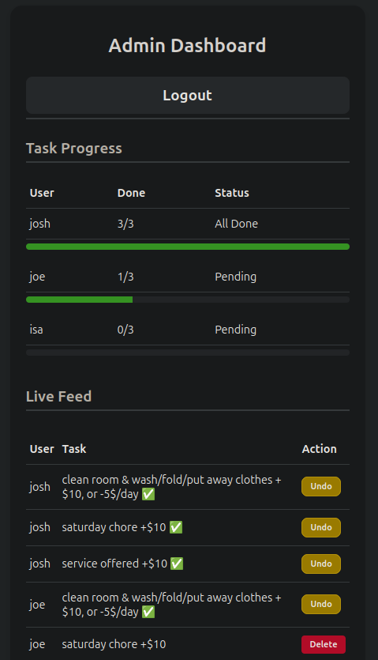
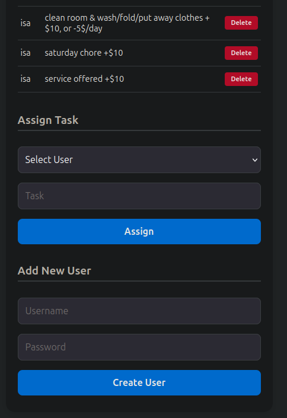
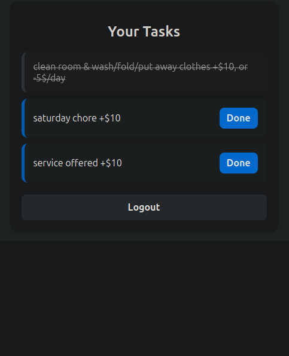
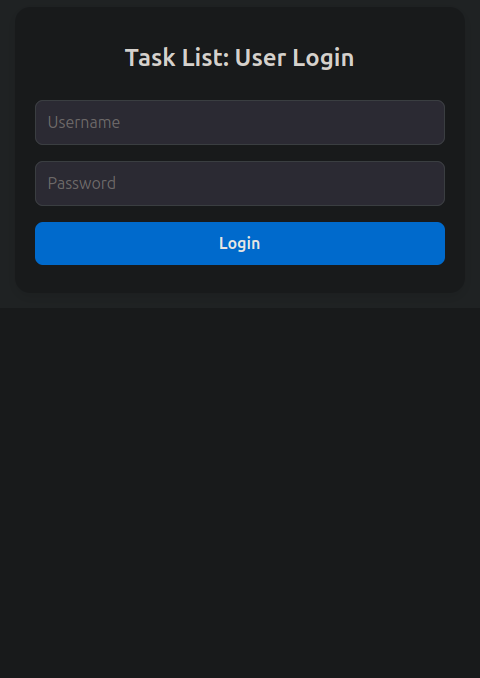

<h1>Multi-User Task Tracker</h1>

A lightweight, secure, and mobile-responsive web application for managing tasks across users.  
Built with Java 25 and SQLite. 

 
 Screenshots from a mobile phone browser above: 
<h2>Features</h2>
<ul><li>Role-based access control: A separate interface for Admins and Users with their respective controls 
<li>Live progress tracking: Admins can see Users task progression 
<li>Mobile-friendly design: Looks good and easy to use on mobile phones as well as computers
<li>Persistent storage: SQLite database remains safe and intact after updates or changes
</ul>
<h2>Security Implementations</h2>
<ul>
<li>Session Management: Implemented secure UUID-based session tokens with HttpOnly cookies to prevent Session Hijacking and IDOR attacks.

<li>SQL Injection Prevention: 100% coverage using PreparedStatements for all database interactions.

<li>XSS Protection: Automatic HTML entity escaping for all user-generated content (usernames and task descriptions).

<li>Access Control: Server-side verification of administrative privileges for all sensitive actions (adding users, clearing feeds).
</ul>

<h2>Tech Stack</h2>
<ul>
<li>Language: Java (using the built-in com.sun.net.httpserver)

<li>Database: SQLite 3

<li>Frontend: Vanilla HTML5 and CSS3 
</ul>
<h2>Installation and Setup</h2>
<ol>
<li>Prerequisites: Java 25 installed on server
<li>Clone the repo:  
  
  `git clone https://github.com/js-2507/Multi-User-Task-Tracker.git`
<li>Add Dependencies: Download the <a href="https://github.com/xerial/sqlite-jdbc">sqlite-jdbc</a> JAR file and add it to your classpath.</li>
<li>To deploy, do this in the intellij project (or project directory) terminal on your local machine 
  
`#1. Compile` 
  
`javac -cp "lib/*" src/*.java -d bin/` 
`#2. Create a simple JAR` 
`jar cfe chore-app.jar Main -C bin .` 
</li>
<li>Then send the .jar file and the lib folder to your server (in your folder for the service) 
you can use FileZilla or WinSCP for an easy GUI transfer or use the terminal
<li>To start the .jar file, enter
  
  `java -cp "chore-app.jar:lib/*" Main`</li>
<li>(Optional) To make it a systemd service (for best availability in case of power outage/restarting) 
On your server, go to
  
  `/etc/systemd/system` and create a `chore.service` using `sudo nano`
add this:   
`[Unit]`
`Description=Household Chore Tracker Service` 
`# Wait for the network to be ready before starting` 
`After=network.target` 

`[Service]` 
`# The user that will run the app (usually your username, replace user)` 
`User=user` 
`# The folder where your .jar and chores.db are located (replace filepath)` 
`WorkingDirectory=/home/user/filepath` 
`# The command to start your app` 
`ExecStart=/usr/bin/java -cp "chore-app.jar:lib/*" Main` 
`# Restart the app automatically if it crashes` 
`Restart=always` 
`# Optional: standard output logs` 
`StandardOutput=syslog` 
`StandardError=syslog` 
`SyslogIdentifier=chore-app` 

`[Install]` 
`# This tells Ubuntu to start the service during a normal boot` 
`WantedBy=multi-user.target`  

Then do `sudo systemctl daemon-reload` and
`sudo systemctl enable chore.service` and `sudo systemctl start chore.service`
</li>
</ol>
<h2>How to Use</h2>
Service runs on port 8000, you can set up a reverse proxy and make a DNS record to attach a custom URL to make it easier to fnd 
for web admin and use,  
The admin can add users (and their usernames/passwords), add tasks for users, undo task progress, clear tasks
for users, and see progress of all users tasks. 
Default admin username is 'admin' and password is 'admin123$' (can be changed in Database.java file, line 28).
Users can see only their tasks through login, and can mark tasks as complete.
<h2>License</h2>
Any contributions and improvements are appreciated! 
